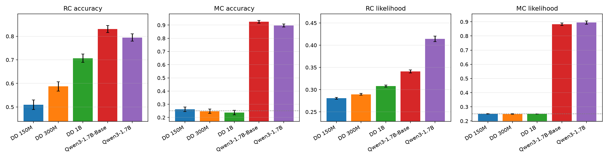
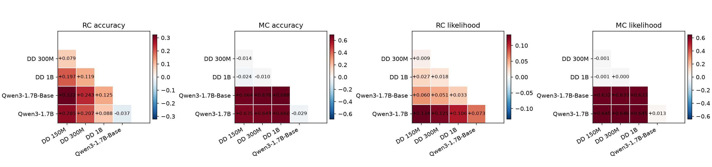
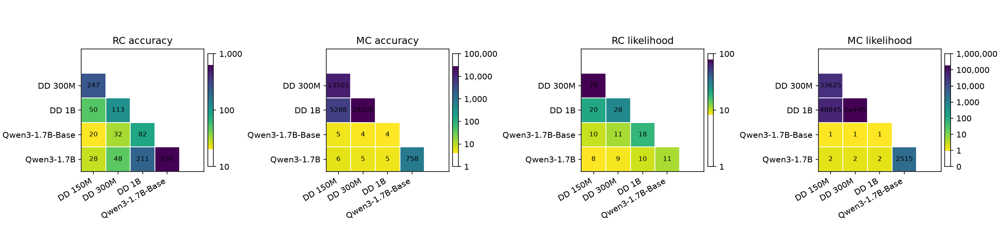
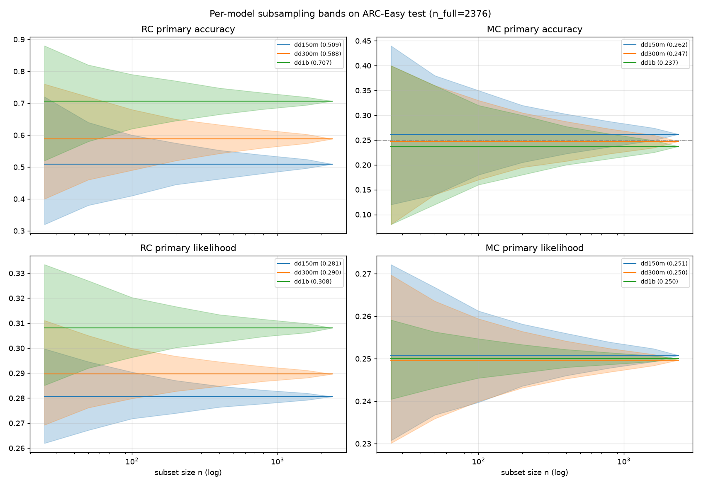
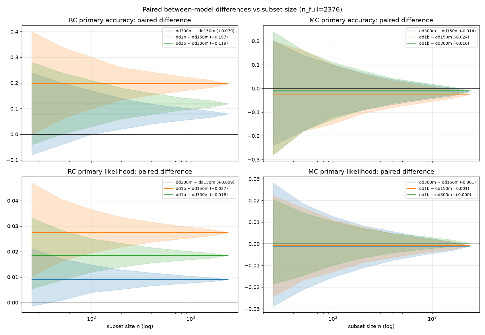
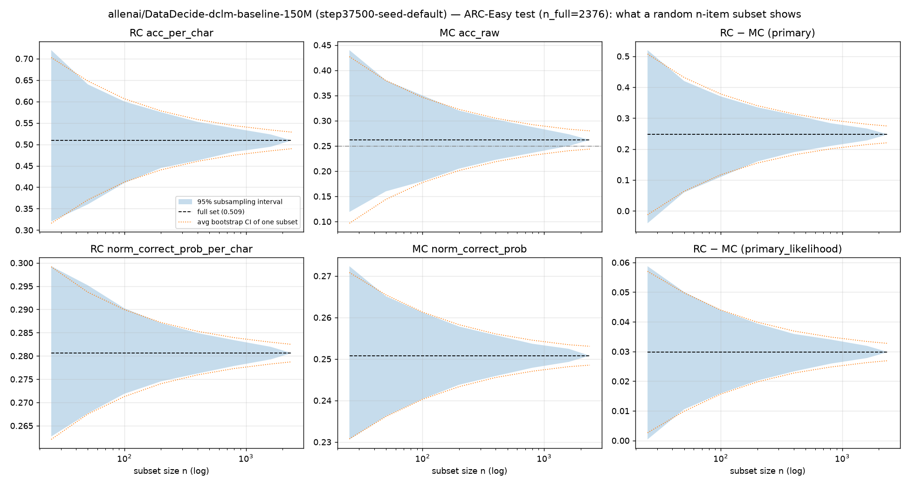
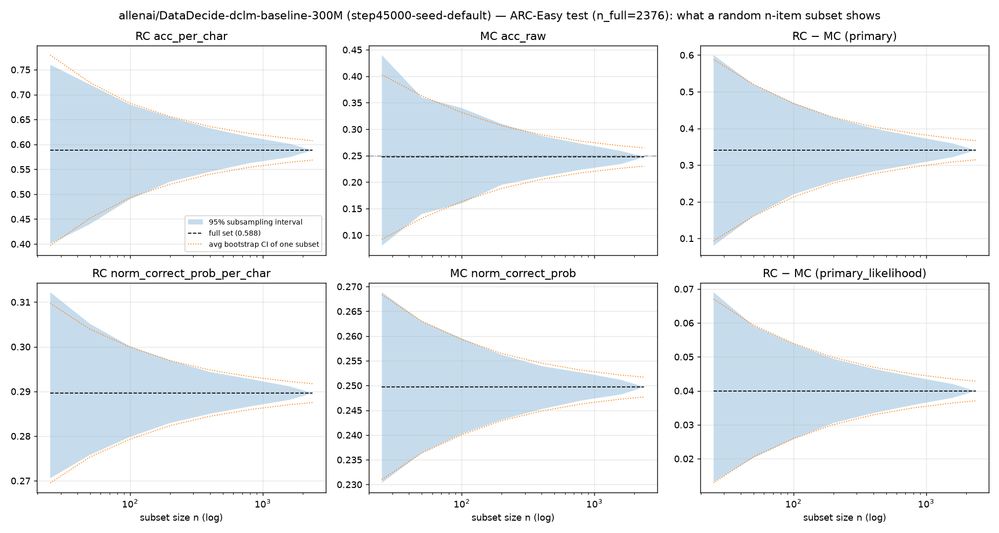
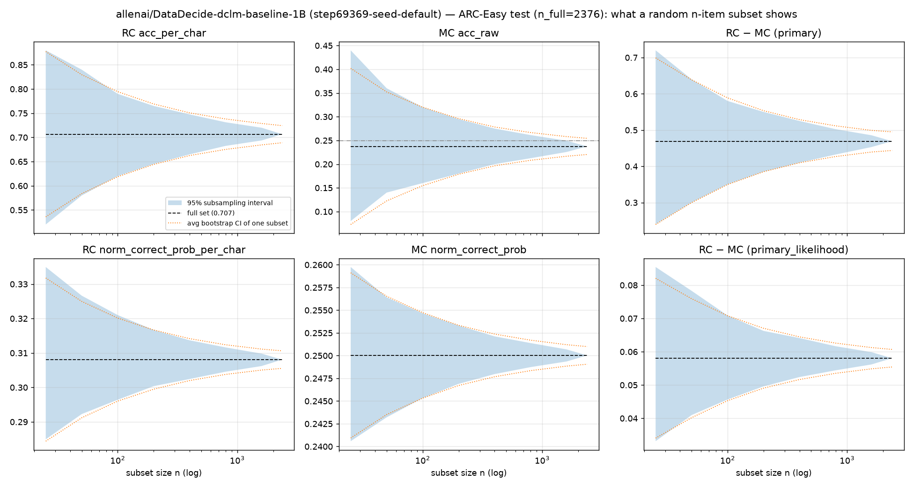
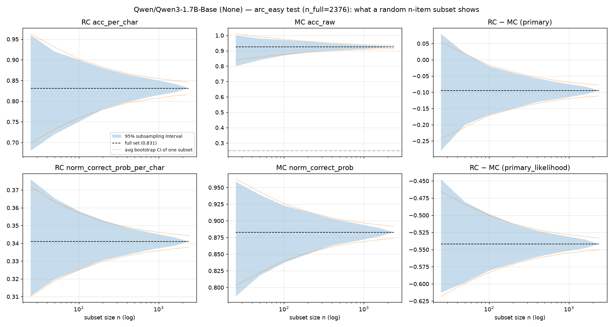
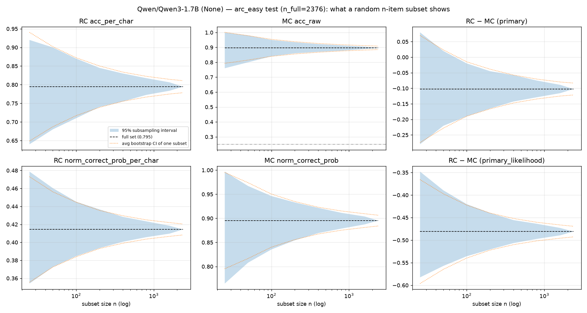

# Subset size vs findings on the full ARC-Easy test set (2026-09-17 10:40)

Full 2376-item ARC-Easy test runs, OLMES defaults (canonical prompt, no instruction,
RC and MC), for DataDecide 150M (step 37500), 300M (step 45000), 1B (step 69369),
Qwen3-1.7B-Base and Qwen3-1.7B (updated 12:20 with the Qwen runs). Scripts:
`scripts/po_subset_bootstrap.py`, `scripts/po_subset_compare.py`. Packet with all
outputs: `~/drotherm/data/.claude/datadec/2026-09-17/0949-arc-easy-subset-size/`;
plots and tables copied to `assets/2026-09-17-arc-easy-subset-size/`.

## Summary

- **MC is a null instrument for DataDecide through 1B, and the strongest instrument for
  Qwen.** Full-set MC accuracy: 150M 0.262, 300M 0.247, 1B 0.237 (MC likelihood share
  0.250 for all three); Qwen3-1.7B-Base 0.926, Qwen3-1.7B 0.897. RC scales cleanly:
  accuracy 0.509 / 0.588 / 0.707 / 0.831 / 0.795, per-char share 0.281 / 0.290 / 0.308 /
  0.341 / 0.414. For Qwen, MC beats RC by about 0.10 on accuracy.
- **Base vs instruct Qwen are within noise on accuracy but not on likelihood.** RC
  accuracy differs by 0.037 (needs ~630 items) and MC by 0.029 (~760 items); the RC
  per-char share differs by 0.073, detectable with ~11 items, because the instruct
  model is far more confident on the items it gets right.
- **Our 100-item subset's 300M MC value (0.16) was noise**, near the bottom of the
  n=100 band [0.17, 0.33]; the full set is at chance.
- **100 items resolve RC vs MC but not model-vs-model on accuracy.** The 300M-over-150M
  RC accuracy gain (+0.079) needs ~250 items at 80% power; on the per-char likelihood
  the same gain (+0.009) needs ~80. Likelihood needs a third to a quarter of the items
  accuracy needs for every model pair.
- **Reference scale for prompt effects:** a 150M-to-300M doubling is worth 0.009 on the
  per-char share; detecting a 0.005 paired difference at 80% power takes ~260 items at
  the measured item sd (0.029).
- A single subset's percentile bootstrap tracks the true subsampling band closely at
  every n, so bootstrapping a subset is an honest guide to its uncertainty.

### Model-vs-model paired differences (n needed for 80% power, two-sided 5%)

| pair | RC acc diff | item sd | n for 80% | RC per-char share diff | item sd | n for 80% |
|---|---|---|---|---|---|---|
| 300M − 150M | +0.079 | 0.442 | 247 | +0.009 | 0.029 | 79 |
| 1B − 300M | +0.119 | 0.451 | 113 | +0.018 | 0.035 | 28 |
| 1B − 150M | +0.197 | 0.499 | 50 | +0.027 | 0.044 | 20 |
| Qwen-Base − 1B | +0.125 | 0.404 | 82 | +0.033 | 0.050 | 18 |
| Qwen − Qwen-Base | -0.037 | 0.328 | 630 | +0.073 | 0.087 | 11 |

MC differences among the DD models are all within 0.024 and need thousands of items;
Qwen vs any DD model on MC is +0.64 to +0.69 and resolved by 5 items.

## Per-model subset-size plots

Blue band: 2.5-97.5 percentile of the mean over random n-item subsets (true spread).
Orange dotted: the percentile-bootstrap interval a single n-item subset would report.
Dashed: full-set value.

## Details

### Full-set values and n=100 bands

| model | RC acc_per_char | n=100 band | RC per-char share | n=100 band | MC acc_raw | n=100 band |
|---|---|---|---|---|---|---|
| 150M | 0.509 | [0.410, 0.600] | 0.281 | [0.272, 0.290] | 0.262 | [0.180, 0.350] |
| 300M | 0.588 | [0.490, 0.680] | 0.290 | [0.280, 0.300] | 0.247 | [0.170, 0.330] |
| 1B | 0.707 | [0.620, 0.790] | 0.308 | [0.296, 0.320] | 0.237 | [0.160, 0.320] |
| Qwen3-1.7B-Base | 0.831 | [0.760, 0.900] | 0.341 | [0.327, 0.358] | 0.926 | [0.870, 0.970] |
| Qwen3-1.7B | 0.795 | [0.720, 0.870] | 0.414 | [0.386, 0.444] | 0.897 | [0.840, 0.950] |

### RC − MC within model (paired per item)

| model | acc diff | item sd | n for 80% | share diff | item sd | n for 80% |
|---|---|---|---|---|---|---|
| 150M | +0.247 | 0.676 | 58 | +0.030 | 0.073 | 47 |
| 300M | +0.340 | 0.656 | 29 | +0.040 | 0.072 | 26 |
| 1B | +0.469 | 0.613 | 13 | +0.058 | 0.066 | 10 |
| Qwen3-1.7B-Base | -0.094 | 0.412 | 150 | -0.542 | 0.215 | 1 |
| Qwen3-1.7B | -0.102 | 0.464 | 162 | -0.481 | 0.300 | 3 |

For Qwen the RC-vs-MC likelihood gap is dominated by scale: the MC share is a
one-token softmax near 0.9 while the RC per-char share is compressed to about 0.35-0.41,
so the two formulations' likelihood values are not on a common scale even though
their accuracies are.

### Our seed-0 subset vs the full set

| model | RC acc (subset / full) | RC share (subset / full) | MC acc (subset / full) |
|---|---|---|---|
| 150M | 0.570 / 0.509 | 0.282 / 0.281 | 0.280 / 0.262 |
| 300M | 0.610 / 0.588 | 0.291 / 0.290 | 0.160 / 0.247 |
| 1B | 0.690 / 0.707 | 0.307 / 0.308 | 0.250 / 0.237 |
| Qwen3-1.7B-Base | 0.800 / 0.831 | 0.339 / 0.341 | 0.950 / 0.926 |
| Qwen3-1.7B | 0.800 / 0.795 | 0.413 / 0.414 | 0.910 / 0.897 |

Per-size tables with subsampling intervals, bootstrap half-widths, item sd and MDD for
n = 25, 50, 100, 200, 400, 800, 1600, 2376: `assets/2026-09-17-arc-easy-subset-size/
<model>-table.md`; cross-model bands and differences: `compare-table.md`, `bands.csv`,
`differences.csv`.

### Method

Subsampling: 2000 draws without replacement per n. Bootstrap half-width: mean over 100
random n-subsets of the percentile-bootstrap 95% interval (1000 resamples). Power:
minimum detectable paired difference = 2.8 x item sd / sqrt(n); n for 80% power =
(2.8 x sd / effect)^2. All scoring deterministic; the only noise is item sampling.

### Caveats

- 300M is step 45000; the true final checkpoint is step 45787 (0.5B tokens later, on a
  plateau).
- The per-char share is compressed toward chance (absolute values 0.28-0.31 for DD), so
  read it through paired differences, not levels.
- Checkpoint-to-checkpoint noise is not in these bands; the 300M checkpoint runs
  (queued) will add it.
