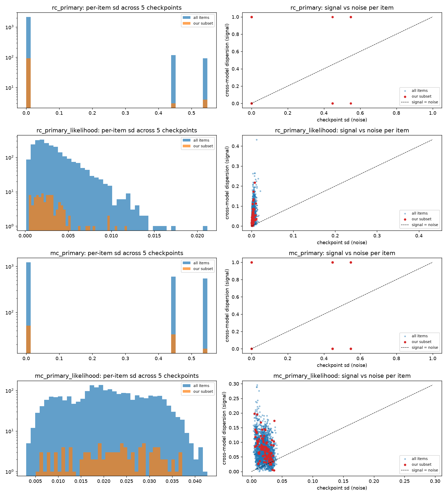

# Per-item checkpoint and seed noise, DataDecide 300M on the full ARC-Easy test set (2026-09-17 11:25)

Noise after Heineman et al. 2025 at item granularity. Checkpoint noise: the last five
seed-default checkpoints (steps 40000, 41250, 42500, 43750, 45000; the final 11% of
training). Seed noise: final checkpoints of seed-default and the two aux seeds
(small-aux-2, small-aux-3, step 127166). Signal: dispersion (max minus min) of each
item's score across 150M, 300M and 1B final checkpoints. Canonical OLMES prompt, RC and
MC. Script: `scripts/po_item_noise.py`; outputs in
`~/drotherm/data/.claude/datadec/2026-09-17/0949-arc-easy-subset-size/noise-dd300m/`,
plot and per-item table copied to `assets/2026-09-17-arc-easy-item-noise-dd300m/`.

## Summary

- **RC accuracy is stable item by item.** 91% of items give the same right/wrong answer
  at all five checkpoints; 8.8% flip at least once and 5.1% twice or more. Aggregate
  checkpoint sd 0.0008.
- **RC per-char likelihood moves a little on every item.** Per-item checkpoint sd:
  median 0.0026, p90 0.0065, p99 0.012. Seed-to-seed is larger: median 0.010, p90 0.027.
  Cross-model dispersion (150M to 1B) has median 0.030, so 93% of items have a
  signal-to-checkpoint-noise ratio above 3 and under 1% are below 1. Aggregate
  checkpoint sd 0.0002, seed sd 0.0010.
- **MC is noise at the item level too.** 48% of items change their MC answer between
  adjacent checkpoints and 50% disagree across seeds; the MC likelihood share has a
  per-item checkpoint sd (median 0.020) of the same order as its cross-model dispersion
  (median 0.069), with 9% of items below SNR 1. This is the label-prior effect seen in
  the Batch Calibration check, now visible per item.
- **Noise floor for prompt effects (RC, per-char share):** a per-item change smaller
  than about 0.003 is within checkpoint jitter and smaller than about 0.010 is within
  seed jitter. On a 100-item mean those floors are roughly 0.0003 and 0.001. Prompt
  effects on DD models reported at the 0.001-0.005 level therefore need to be read
  against the seed floor, not only the item-sampling interval.
- Our seed-0 subset is not unusual: 3% of its items are below SNR 1 on RC accuracy, 1%
  on the RC share, matching the full-set rates.

## Details

| family | aggregate ckpt sd | aggregate seed sd | item ckpt sd median / p90 | item seed sd median / p90 | items constant across ckpts | model dispersion median | items SNR < 1 | items SNR > 3 |
|---|---|---|---|---|---|---|---|---|
| RC acc_per_char | 0.0008 | 0.0028 | 0 / 0 | 0 / 0.577 | 91.2% | 0 | 2.3% | 0% |
| RC per-char share | 0.0002 | 0.0010 | 0.0026 / 0.0065 | 0.0097 / 0.0267 | 0% | 0.030 | 0.8% | 93.3% |
| MC acc_raw | 0.0080 | 0.0032 | 0 / 0.548 | 0 / 0.577 | 51.8% | 1.0 | 21.0% | 0% |
| MC share | 0.0008 | 0.0009 | 0.020 / 0.032 | 0.048 / 0.083 | 0% | 0.069 | 8.8% | 57.7% |

SNR = cross-model dispersion / checkpoint sd; for accuracy families most items have
zero checkpoint sd, so SNR is undefined there and the "SNR < 1" rate counts only items
that flip.

Correlations across items (RC share): checkpoint sd vs seed sd 0.50; checkpoint sd vs
item mean 0.34 (noisier items are the easier ones, whose share is further from chance);
cross-model dispersion vs seed sd 0.53 (items that separate model sizes are also the
ones seeds disagree on, so a signal-only ranking would over-select noisy items and the
ratio is the right criterion).

### Caveats

- The aux seeds are the DataDecide "small aux" runs, trained with a different step
  count (127166 steps to the same 30B tokens); their final checkpoints are the right
  comparison but their trajectories are not aligned with the default seed's.
- Five checkpoints give a coarse per-item sd; the p99 and the SNR tails are the least
  reliable numbers here.
- Cross-model dispersion uses three models; adding Qwen (a different family) would
  change what "signal" means and is kept separate.
